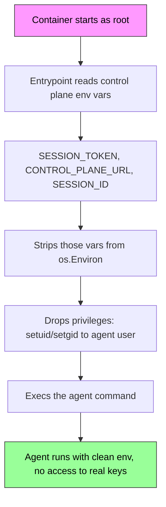

# sandbox-image

The container image that runs AI agents in isolated sandboxes. Same image, two runtimes -- Docker for local dev and Raspberry Pi, Unikraft micro-VMs for macOS and cloud. This is the "Pattern 2" approach: isolate the entire agent, not just the tools.

Part of the agent sandbox system:

| Repo | What it does |
|---|---|
| **[control-plane](https://github.com/Travbz/control-plane)** | Orchestrator -- config, secrets, provisioning, tools, memory |
| **[llm-proxy](https://github.com/Travbz/llm-proxy)** | Credential-injecting LLM reverse proxy with token metering |
| **[sandbox-image](https://github.com/Travbz/sandbox-image)** | This repo -- container image, entrypoint, env stripping, privilege drop |
| **[api-gateway](https://github.com/Travbz/api-gateway)** | Customer-facing REST API -- job submission, SSE streaming, billing |
| **[tools](https://github.com/Travbz/tools)** | MCP tool monorepo -- spec, reference tools |
| **[agent](https://github.com/Travbz/agent)** | Reference agent implementation |

---

## What happens at boot



The entrypoint binary is a small Go program that acts as PID 1. It handles the security-sensitive setup that the agent itself should never see: reading the session token, cleaning the environment, and dropping from root to an unprivileged user. By the time the agent process starts, the control plane credentials are gone from the environment.

---

## Environment variables

### Control plane vars (read and stripped by entrypoint)

| Variable | Purpose |
|---|---|
| `SESSION_TOKEN` | Session token for authenticating with llm-proxy |
| `CONTROL_PLANE_URL` | Base URL of the llm-proxy |
| `SESSION_ID` | Identifier for this sandbox session |

These are consumed by the entrypoint and **deleted** before the agent starts. The agent never sees them.

### Agent configuration

| Variable | Default | Purpose |
|---|---|---|
| `AGENT_COMMAND` | (from CLI args) | Binary to exec (e.g. `claude`, `opencode`) |
| `AGENT_ARGS` | (from CLI args) | Space-separated arguments |
| `AGENT_USER` | `agent` | User to drop privileges to |
| `AGENT_WORKDIR` | `/workspace` | Working directory for the agent |

### Injected secrets (from control-plane)

Any secrets configured with `mode = "inject"` in `sandbox.toml` are passed as regular env vars. These survive the stripping step -- only the control plane vars are removed.

---

## Building

### The image

```bash
# local platform only (fast)
make image-local

# multi-arch for amd64 + arm64 (Pi)
make image
```

### Just the entrypoint binary

```bash
make build    # output: ./build/entrypoint
make test     # run tests
```

Requires Go 1.24+.

---

## The Dockerfile

Two-stage build. First stage compiles the Go entrypoint with `CGO_ENABLED=0` for a static binary. Second stage is Alpine with common agent tooling pre-installed:

- bash, curl, git, openssh-client
- python3, nodejs, npm

The `agent` user (uid 1000) owns `/workspace`. The entrypoint starts as root for privilege management, then drops to `agent` before exec-ing the agent command.

### Multi-arch

The image builds for `linux/amd64` and `linux/arm64`. This means the same image runs on:
- Intel/AMD dev machines
- Apple Silicon Macs (via Docker Desktop)
- Raspberry Pi (arm64)

---

## Running standalone

You don't need the full control-plane to test the image:

```bash
# build it
make image-local

# run with a simple command
docker run --rm \
  -e AGENT_COMMAND=echo \
  -e AGENT_ARGS="hello from sandbox" \
  -e AGENT_USER=root \
  sandbox-image:latest

# run with an agent (assuming claude is installed in the image)
docker run --rm \
  -e SESSION_TOKEN=my-token \
  -e CONTROL_PLANE_URL=http://host.docker.internal:8090 \
  -e SESSION_ID=dev-session \
  -e AGENT_COMMAND=claude \
  -e ANTHROPIC_API_KEY=session-my-token \
  -v "$(pwd)/workspace:/workspace" \
  sandbox-image:latest
```

---

## Project structure

```
sandbox-image/
├── entrypoint/
│   ├── main.go              # entrypoint binary (PID 1)
│   └── main_test.go
├── Dockerfile               # multi-arch container image
├── Makefile
├── go.mod
├── flake.nix
├── .releaserc.yaml
└── .github/workflows/
    ├── ci.yaml              # build + test + docker build on PRs
    └── release.yaml         # semantic-release + push to GHCR on main
```

---

## Versioning

Automated with [semantic-release](https://github.com/semantic-release/semantic-release) from [conventional commits](https://www.conventionalcommits.org/). On merge to `main`, CI builds the multi-arch image and pushes it to GitHub Container Registry.
