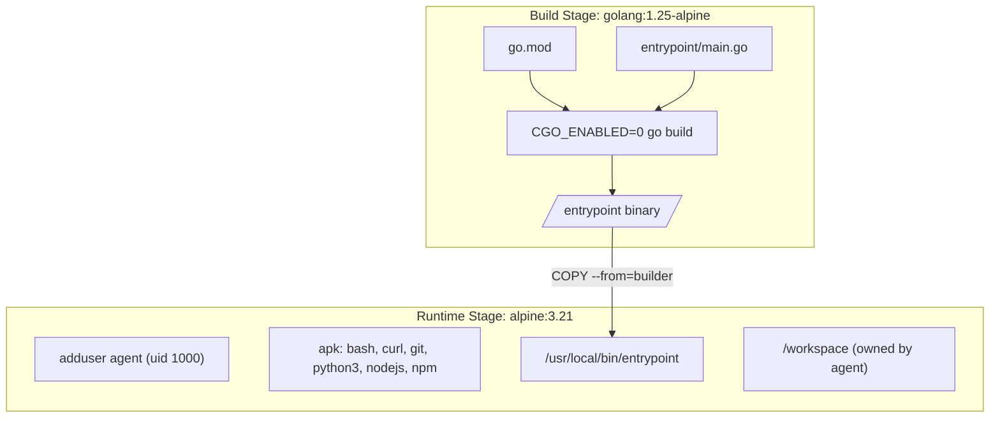
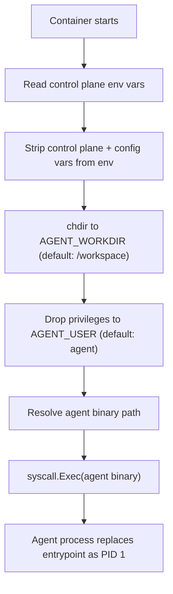

# Architecture

The sandbox image is a Docker container that runs agent code in isolation. The agent process has no direct access to host secrets, the host filesystem (beyond shared mounts), or the control plane's internal state. The image provides the entrypoint binary, a minimal set of tools, and a non-root user to run the agent as.

## Image build: two stages



**Build stage** (`golang:1.25-alpine`): Compiles the entrypoint binary with `CGO_ENABLED=0` to produce a fully static binary. No external Go dependencies -- the binary uses only the standard library (`os`, `syscall`, `strings`, `strconv`).

**Runtime stage** (`alpine:3.21`): Sets up the environment the agent runs in:
- Creates `agent` user (UID 1000, GID 1000)
- Creates `/workspace` directory owned by `agent`
- Installs common CLI tools (bash, curl, git, openssh-client, python3, nodejs, npm)
- Copies the compiled entrypoint binary into `/usr/local/bin/entrypoint`

## Multi-arch support

The Dockerfile is architecture-agnostic. The CI pipeline builds for both `linux/amd64` and `linux/arm64` using `docker buildx`:

```bash
docker buildx build --platform linux/amd64,linux/arm64 -t sandbox-image .
```

This is critical for running on both x86 machines (cloud VMs, dev laptops) and ARM machines (Raspberry Pi, Apple Silicon via Docker Desktop).

## Entrypoint lifecycle

The entrypoint binary runs as PID 1 inside the container. Its job is to sanitize the environment and hand off to the real agent process.



After `syscall.Exec`, the entrypoint binary is gone. The agent process becomes PID 1. This is not a fork -- the process image is completely replaced. The agent inherits only the sanitized environment variables.

## What the agent sees

From the agent's perspective:

| Resource | Visible? | Details |
|---|---|---|
| Host filesystem | Only shared mounts | `/workspace` is typically bind-mounted to a host directory |
| Control plane secrets | No | `SESSION_TOKEN`, `CONTROL_PLANE_URL`, `SESSION_ID` are stripped |
| Injected secrets | Yes | Secrets with `mode = "inject"` appear as env vars |
| Provider base URLs | Yes | `ANTHROPIC_BASE_URL`, `OPENAI_BASE_URL`, etc. for proxy routing |
| Network | Limited | LLM calls go through the proxy, not direct to internet |
| Tools | Yes | bash, curl, git, python3, nodejs, npm are pre-installed |

## File sync

The control plane bind-mounts host directories into the sandbox at startup. These are configured in `sandbox.toml`:

```toml
[shared_dirs]
workspace = { host = "./workspace", guest = "/workspace" }
output    = { host = "./output",    guest = "/output"    }
```

The bind mounts are read-write by default. The agent can read and write files in these directories, and changes are immediately visible on the host.
