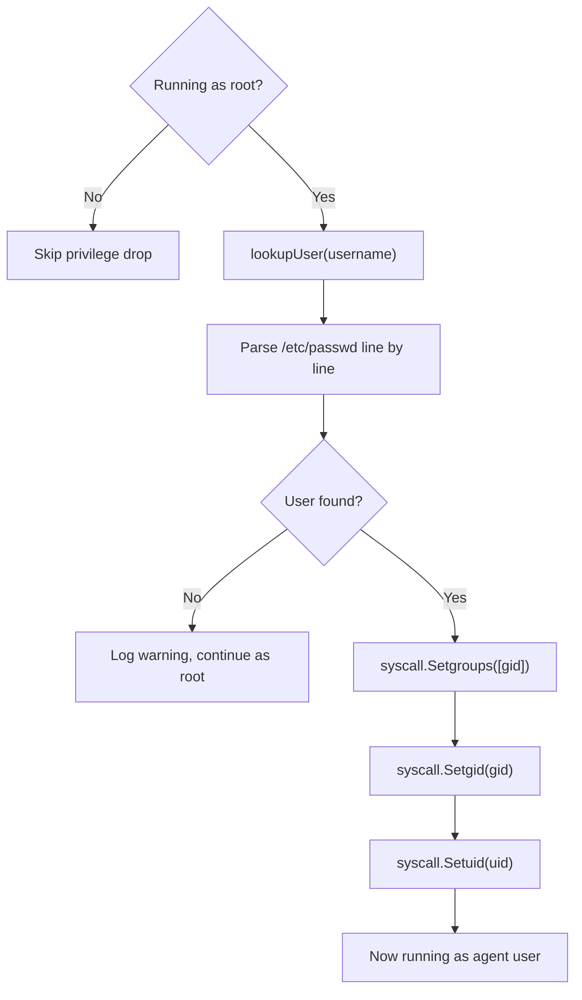

# Entrypoint Binary

The entrypoint is a small Go binary that runs as PID 1 when the container starts. It has three jobs: strip sensitive environment variables, drop root privileges, and exec the agent command.

Source: `entrypoint/main.go`

## Boot sequence

### 1. Read control plane variables

The entrypoint reads three env vars set by the control plane during provisioning:

| Variable | Purpose |
|---|---|
| `SESSION_TOKEN` | The session token for the llm-proxy. The agent never needs this directly -- the SDK base URL is already pointed at the proxy. |
| `CONTROL_PLANE_URL` | URL of the control plane API. Used if the sandbox needs to phone home (currently unused by agents). |
| `SESSION_ID` | Identifier for this sandbox session. |

These are read into local Go variables, then immediately unset from the process environment with `os.Unsetenv`.

### 2. Strip env vars

After reading, the following env vars are removed from the process environment:

**Control plane vars (always stripped):**
- `SESSION_TOKEN`
- `CONTROL_PLANE_URL`
- `SESSION_ID`

**Agent config vars (stripped after reading):**
- `AGENT_COMMAND`
- `AGENT_ARGS`
- `AGENT_USER`
- `AGENT_WORKDIR`

**What remains visible to the agent:**
- Secrets injected in `inject` mode (e.g., `GITHUB_TOKEN`, `SSH_KEY`)
- Provider base URLs (e.g., `ANTHROPIC_BASE_URL`, `OPENAI_BASE_URL`, `OLLAMA_HOST`)
- Standard container env vars (`PATH`, `HOME`, etc.)

### 3. Resolve agent command

The agent command is determined in priority order:

1. `AGENT_COMMAND` env var (set by control plane from `sandbox.toml`)
2. CLI arguments passed to the entrypoint (`/usr/local/bin/entrypoint my-agent --flag`)

Agent arguments follow the same pattern: `AGENT_ARGS` env var first, then positional CLI args.

### 4. Set working directory

Calls `os.Chdir` to the directory specified by `AGENT_WORKDIR` (default: `/workspace`). If the directory doesn't exist, a warning is logged to stderr but the process continues.

### 5. Drop privileges

If running as root (UID 0), the entrypoint drops to the target user:



The user lookup reads `/etc/passwd` directly instead of using `os/user`. This avoids pulling in cgo, which would break static compilation. The lookup parses colon-delimited fields to extract UID and GID.

**Syscall order matters.** `Setuid` must be called last because once you drop from root, you can't call `Setgid` or `Setgroups` anymore.

The default user is `agent` (UID 1000, GID 1000), created in the Dockerfile.

### 6. Exec the agent

The final step replaces the entrypoint process entirely:

```go
syscall.Exec(agentBin, argv, env)
```

This is a Unix `execve` -- not `fork+exec`. The entrypoint binary is completely replaced by the agent process. The agent inherits:

- The sanitized environment (`os.Environ()` at this point)
- The working directory set in step 4
- The UID/GID from step 5
- stdin, stdout, stderr from the container runtime

After `execve`, the entrypoint code is gone from memory. The agent is now PID 1.

## Security model

The design ensures a layered defense:

1. **Env stripping.** Even if the agent enumerates `os.Environ()`, control plane secrets are not there.
2. **Privilege drop.** The agent runs as `agent:agent` (1000:1000), not root. It can't install system packages, modify `/etc`, or access root-owned files.
3. **No secrets on disk.** The entrypoint reads everything from env vars. There are no secret files in the image.
4. **Static binary.** The entrypoint has no dynamically linked dependencies. No shared libraries to attack.
5. **Process replacement.** After exec, the entrypoint is gone. The agent can't inspect the entrypoint's memory because it no longer exists.

## Error handling

| Error | Behavior |
|---|---|
| No agent command specified | Fatal, exit 1 |
| Agent binary not found in PATH | Fatal, exit 1 |
| `syscall.Exec` fails | Fatal, exit 1 |
| `Setuid` or `Setgid` fails | Fatal, exit 1 |
| User not found in `/etc/passwd` | Warning logged, continues as current user |
| `chdir` to workdir fails | Warning logged, continues in current directory |
| Not running as root | Warning logged, privilege drop skipped |

All log output goes to stderr with the `[entrypoint]` prefix for easy filtering.
