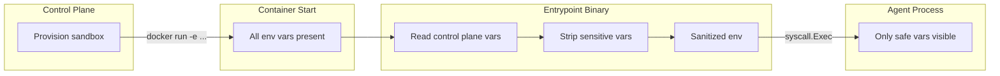

# Environment Variables

This document covers every environment variable the sandbox image interacts with -- what sets them, when they're stripped, and what the agent ultimately sees.

## Variable lifecycle

## Control plane variables (stripped)

These are set by the control plane during provisioning and removed by the entrypoint before the agent starts. The agent never sees them.

| Variable | Example value | Purpose |
|---|---|---|
| `SESSION_TOKEN` | `a1b2c3d4e5f6` | Session token for the llm-proxy. |
| `CONTROL_PLANE_URL` | `http://host.docker.internal:9000` | Control plane API address. |
| `SESSION_ID` | `sandbox-dev-1` | Unique identifier for this sandbox run. |

## Agent config variables (stripped)

These configure the entrypoint's behavior and are removed after being read. The agent doesn't see them.

| Variable | Default | Purpose |
|---|---|---|
| `AGENT_COMMAND` | (none, required) | The binary or script to exec as the agent. |
| `AGENT_ARGS` | (none) | Space-separated arguments for the agent command. |
| `AGENT_USER` | `agent` | Unix user to drop privileges to. |
| `AGENT_WORKDIR` | `/workspace` | Working directory for the agent process. |

## Injected secrets (kept)

Secrets configured with `mode = "inject"` in `sandbox.toml` are set as plain environment variables. These survive the stripping phase because the entrypoint only removes specific known variable names.

| Variable | Example value | Source |
|---|---|---|
| `GITHUB_TOKEN` | `ghp_abc123...` | `secrets.add GITHUB_TOKEN --mode inject` |
| `SSH_KEY` | `-----BEGIN OPENSSH...` | `secrets.add SSH_KEY --mode inject` |
| `CUSTOM_API_KEY` | `my-api-key` | Any user-defined secret |

These are visible to the agent via `os.Environ()` or `$GITHUB_TOKEN` in shell scripts.

## Provider base URLs (kept)

For secrets in `proxy` mode, the control plane sets the SDK base URL to point at the proxy. These tell the LLM SDK where to send requests.

| Variable | Value (typical) | Triggers on |
|---|---|---|
| `ANTHROPIC_BASE_URL` | `http://host.docker.internal:8090` | Any `proxy` secret with `provider = "anthropic"` |
| `OPENAI_BASE_URL` | `http://host.docker.internal:8090` | Any `proxy` secret with `provider = "openai"` |
| `OLLAMA_HOST` | `http://host.docker.internal:8090` | Any `proxy` secret with `provider = "ollama"` |

The agent's LLM SDK reads these automatically (most SDKs honor `*_BASE_URL` out of the box). The agent doesn't need to know it's going through a proxy -- it just works.

## Standard container variables (kept)

These are set by the container runtime and survive untouched:

| Variable | Typical value |
|---|---|
| `PATH` | `/usr/local/sbin:/usr/local/bin:/usr/sbin:/usr/bin:/sbin:/bin` |
| `HOME` | `/home/agent` |
| `HOSTNAME` | Container ID |
| `TERM` | `xterm` |

## Summary table

| Category | Set by | Stripped? | Agent sees? |
|---|---|---|---|
| Control plane vars | Control plane | Yes | No |
| Agent config vars | Control plane | Yes | No |
| Injected secrets | Control plane (inject mode) | No | Yes |
| Provider base URLs | Control plane (proxy mode) | No | Yes |
| Container vars | Docker runtime | No | Yes |
